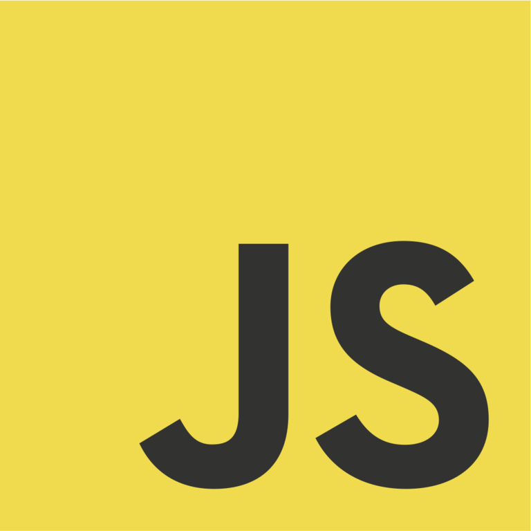
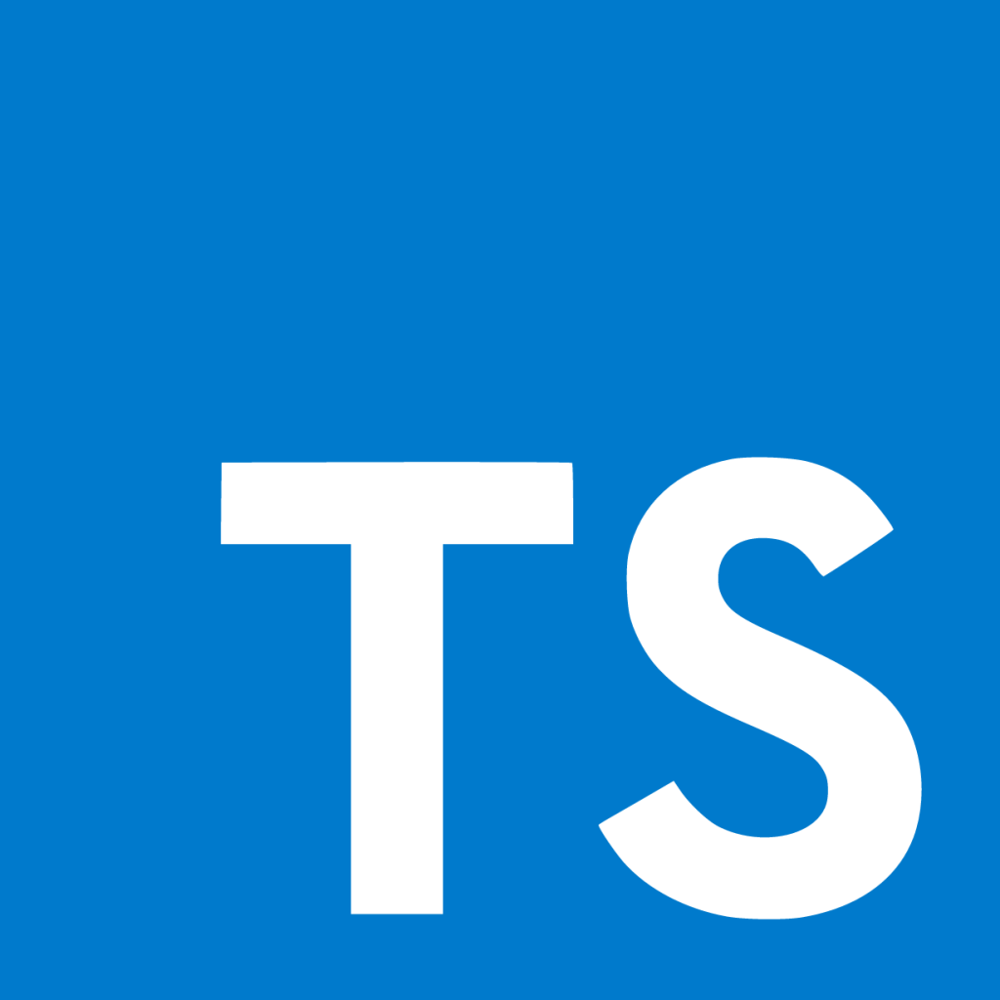
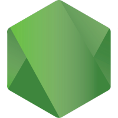
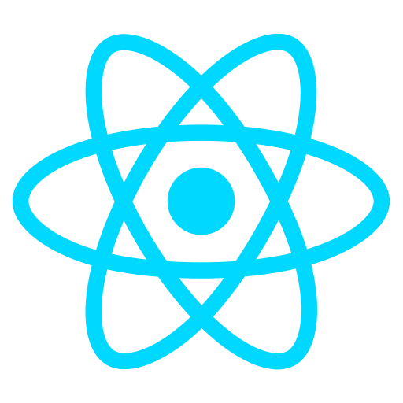
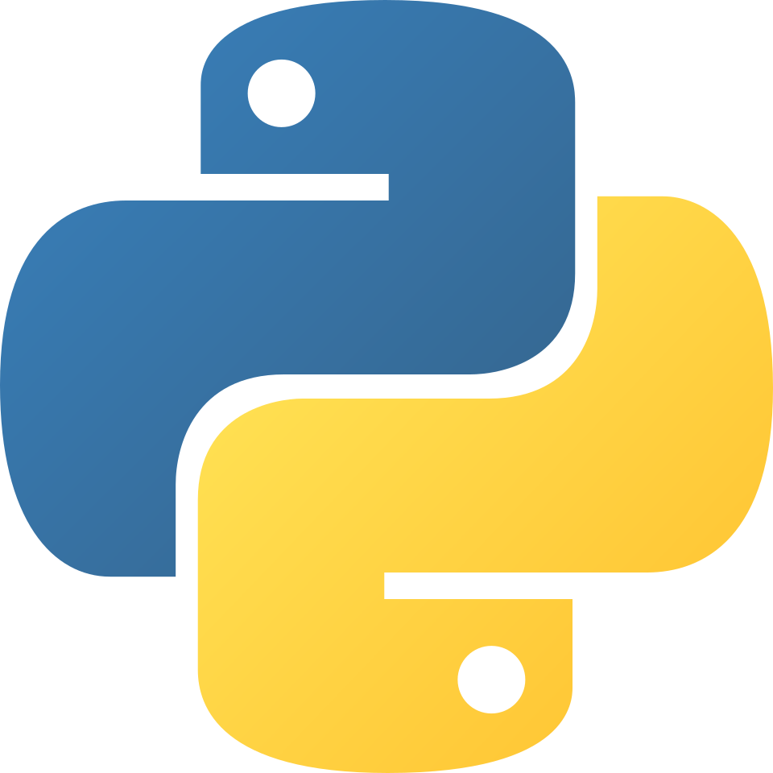

<h1 align="left">Matheus Sartori</h1>

I’m always learning, experimenting, and trying to keep up with the never-ending world of web and mobile development.

I enjoy turning ideas into real products, fixing messy problems, and building things that are actually useful, not just pretty on paper. I’ve worked on different kinds of systems and like thinking about clean code, good architecture, and solutions that can grow without becoming a nightmare later.

What keeps me motivated is the fact that technology never really stands still. There’s always a new tool to test, a better way to solve something, or a bug waiting to humble you at 2 AM.

Outside of code, I produce and perform music with [my metalcore band](https://www.youtube.com/watch?v=Bok8v_J0Q0o), which keeps me creative, disciplined, and obsessed with building things that actually work live.

## What I’m focused on

- Building full-stack applications with React, Node.js, TypeScript and NestJS
- Designing APIs, backend services and clean architectures
- Working with Docker, MySQL and production-ready development workflows
- Exploring Python, AWS and AI-assisted development

<h2 align="left">Favorite Tech</h2>

> Some of the tools, languages, and other things that I like to work with.

<table>
  <tr>
    <td align="center" width="96">
      
       JavaScript
    </td>
    <td align="center" width="96">
      
       TypeScript
    </td>
    <td align="center" width="96">
      
       Node.js
    </td>
    <td align="center" width="96">
      
       React
    </td>
    <td align="center" width="96">
      
       NestJS
    </td>
    <td align="center" width="96">
      
       Python
    </td>
    <td align="center" width="96">
      
       Docker
    </td>
    <td align="center" width="96">
      
       MySQL
    </td>
  </tr>
</table>

